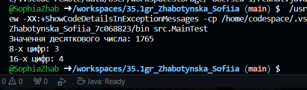

# Завдання 04.03.24
Виконала Жаботинська Софія, 35 група
## Умова завдання
1. Розробити клас, що серіалізується, для зберігання параметрів і результатів
обчислень.
Використовуючи агрегування, розробити клас для знаходження рішення
задачі. 
2. Розробити клас для демонстрації в діалоговому режимі збереження та
відновлення стану об'єкта, використовуючи серіалізацію. Показати особливості
використання transient полів. 
3. Розробити клас для тестування коректності результатів обчислень та
серіалізації/десеріалізації.
Використовувати докладні коментарі для автоматичної генерації
документації засобами javadoc.
4. Виконати індивідуальне завдання згідно номеру в списку.
## Умова індивідуального завдання
Варіант 10
Підрахувати кількість 16-кових та 8-кових цифр у заданому значенні десяткового числа.
## Скріншоти роботи програми
