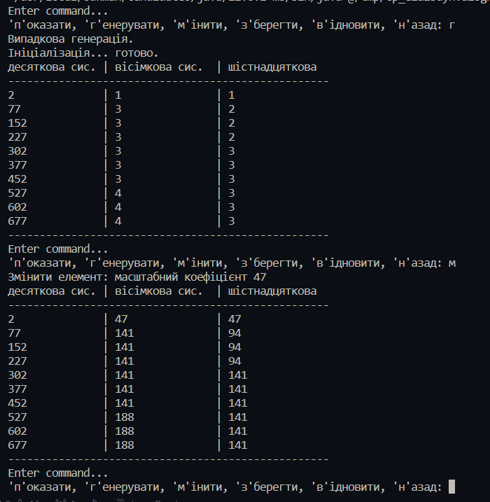
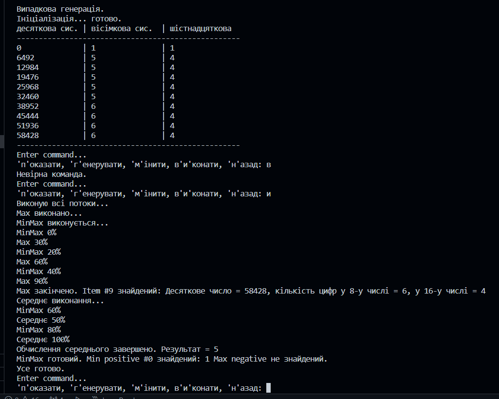

# Умова індивідуального завдання
Варіант 10
Підрахувати кількість 16-кових та 8-кових цифр у заданому значенні десяткового числа.
---
# Завдання 2 від 04.03.24
Виконала Жаботинська Софія, 35 група
## Умова завдання
1. Розробити клас, що серіалізується, для зберігання параметрів і результатів
обчислень.
Використовуючи агрегування, розробити клас для знаходження рішення
задачі. 
2. Розробити клас для демонстрації в діалоговому режимі збереження та
відновлення стану об'єкта, використовуючи серіалізацію. Показати особливості
використання transient полів. 
3. Розробити клас для тестування коректності результатів обчислень та
серіалізації/десеріалізації.
Використовувати докладні коментарі для автоматичної генерації
документації засобами javadoc.
4. Виконати індивідуальне завдання згідно номеру в списку.
## Скріншоти роботи програми

# Завдання 3 "Спадкування" від 05.03.24
1. Як основа використовувати вихідний текст проекту попередньої лабораторної роботи. Забезпечити розміщення результатів обчислень уколекції з можливістю збереження/відновлення.
2. Використовуючи шаблон проектування Factory Method (Virtual Constructor), розробити ієрархію, що передбачає розширення рахунок додавання
нових відображуваних класів.
3. Розширити ієрархію інтерфейсом "фабрикованих" об'єктів, що представляє набір методів для відображення результатів обчислень.
4. Реалізувати ці методи виведення результатів у текстовому виде.
5. Розробити тареалізувати інтерфейс для "фабрикуючого" методу.
## Скріншоти роботи програми
### Успішно виконане тестування MainTest.java

### Результати роботи програми

---
# Завдання 4 'Поліморфізм' від 06.03.24
1. За основу використовувати вихідний текст проекту попередньої лабораторної роботи Використовуючи шаблон проектування Factory Method
(Virtual Constructor), розширити ієрархію похідними класами, реалізують методи для подання результатів у вигляді текстової
таблиці. Параметри відображення таблиці мають визначатися користувачем.
2. Продемонструвати заміщення (перевизначення, overriding), поєднання (перевантаження, overloading), динамічне призначення методів
(Пізнє зв'язування, поліморфізм, dynamic method dispatch).
3. Забезпечити діалоговий інтерфейс із користувачем.
4. Розробити клас для тестування основної функціональності.
5. Використати коментарі для автоматичної генерації документації засобами javadoc.
## Результати роботи програми

## Результати тестування

### *покращенний вигляд таблиці

---
# Завдання 5 'Обробка колекцій' від 07.03.24
1. Реалізувати можливість скасування (undo) операцій (команд).
2. Продемонструвати поняття "макрокоманда"
3.При розробці програми використовувати шаблон Singletone.
4. Забезпечити діалоговий інтерфейс із користувачем.
5. Розробити клас для тестування функціональності програми.
## Результати роботи програми

## Результати тестування

# Завдання 6 'Паралельне виконання' від 08.03.24
1.Продемонструвати можливість паралельної обробки елементів колекції (пошук мінімуму, максимуму, обчислення середнього значення, відбір за критерієм, статистична обробка тощо).
2. Управління чергою завдань (команд) реалізувати за допомогою шаблону Worker Thread.
## Результати роботи програми

## Результати тестування

# Завдання 7 'Паралельне виконання' від 08.03.24
1. Розробити ієрархію класів відповідно до шаблону Observer (java) та продемонструвати можливість обслуговування розробленої раніше колекції (об'єкт, що спостерігається, Observable) різними (не менше двох) спостерігачами (Observers) – відстеження змін, упорядкування, висновок, відображення і т.д.
2. При реалізації ієрархії класів використати інструкції (Annotation). Відзначити особливості різних політик утримання анотацій (annotation retention policies). Продемонструвати підтримку класів концепції рефлексії (Reflection).
3. Використовуючи раніше створені класи, розробити додаток, що відображає результати обробки колекції об'єктів у графічному вигляді
4. Забезпечити діалоговий інтерфейс з користувачем та перемальовування графіка під час зміни значень елементів колекції.
## Результати роботи програми

